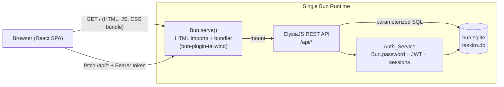
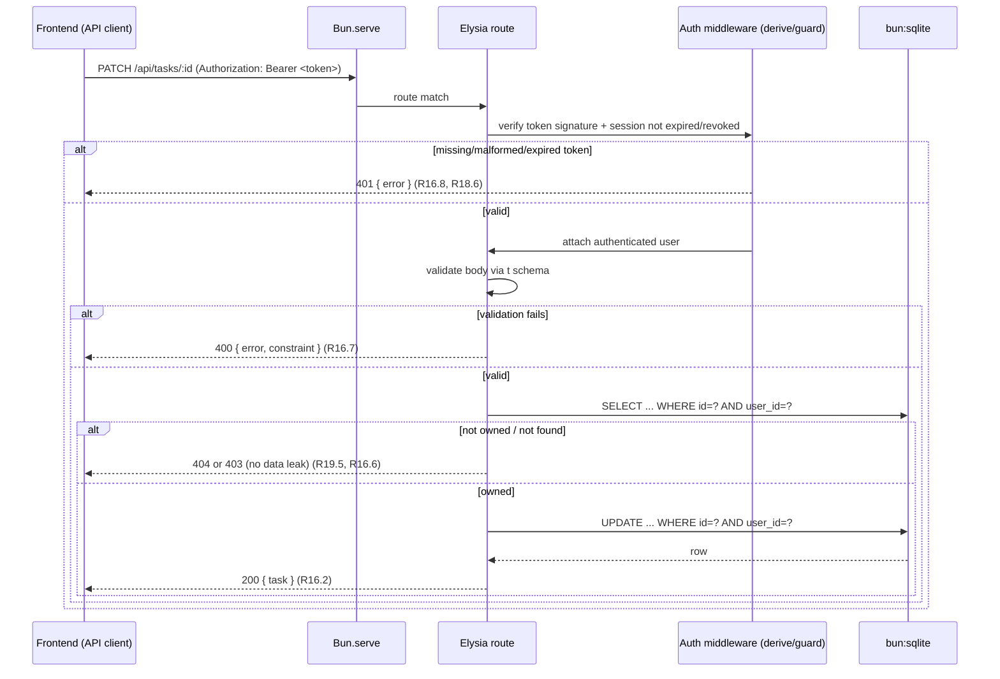

# Design Document

## Overview

TasKiro is migrated from a single-file front-end prototype (`index.html`) into a production-ready full stack application **without changing the product**. The guiding principle is **preservation and visual fidelity**: the migrated app must look and behave like the prototype, with robust components and real persistence underneath.

The target stack is a 100% native Bun ecosystem:

- **Bun Fullstack Dev Server** — `Bun.serve()` with HTML imports bundles and serves the React front end; Bun transpiles `.tsx`/`.css` and downlevels CSS (Requirement 13).
- **Frontend** — React + Tailwind CSS v4 + shadcn/ui (style `new-york`, base color `neutral`, CSS variables in OKLCH), icons via `lucide-react`, all CDN dependencies removed (Requirements 2, 14, 15).
- **Backend** — ElysiaJS REST API exposing Tasks, Projects, Notifications, and authentication endpoints (Requirement 16).
- **Persistence** — native `bun:sqlite`, no external database (Requirement 17).
- **Auth** — real credential verification with `Bun.password` hashing and expiring session tokens, replacing simulated login, with strict per-user data scoping (Requirements 18, 19).

This design is fully traceable to `requirements.md`. Every component, endpoint, data field, and property below cites the requirement(s) it satisfies. The prototype's pt-BR text, layout, colors, iconography, and interaction behavior are treated as the authoritative specification of product behavior (Requirements 1, 2, 20.6).

### Design Principles

1. **Behavior preservation first.** Logic that determines *what the user sees* (filtering, sorting, counts, due-date formatting, board placement, validation) is ported verbatim from the prototype into a pure, framework-independent logic module that is the primary target of property-based testing. Any deviation from prototype behavior requires a documented migration justification (Requirement 1.14, 1.15).
2. **Theme through OKLCH CSS variables only.** All semantic colors are expressed as OKLCH CSS variables; components reference variables, never color literals (Requirements 14.3, 14.7). The only exception is per-record data colors (project color, stored in the database) applied via inline style.
3. **Server-authoritative isolation.** Per-user scoping is enforced in the backend and database, independent of any browser state, so isolation holds across all backend instances (Requirement 19.7).
4. **Overlays managed by accessible primitives.** Dialogs, menus, popovers, and toasts use shadcn/ui (Radix) components so pointer events and focus are correctly managed and hidden overlays never intercept clicks (Requirement 12).

### Research Summary (sources informing this design)

- **Bun Fullstack Dev Server** (Context7, `bun.com/docs/bundler/fullstack`): HTML imports passed to `Bun.serve({ routes })` cause Bun to scan `<script>`/`<link>` tags, bundle/transpile TS/TSX/JSX, downlevel CSS, and serve the result; API routes can be co-located as per-method handlers. `development: { hmr, console }` enables detailed errors and hot reload. This grounds Requirement 13.
- **`bun:sqlite`** (Context7, Bun docs): `new Database(path)`, `db.query(...).get/all/run`, parameterized statements, and `RETURNING *` support; no external service required — grounds Requirement 17.
- **`Bun.password`** (Bun docs): `Bun.password.hash` / `Bun.password.verify` (argon2/bcrypt) — grounds Requirement 18.1–18.3.
- **ElysiaJS** (Context7, `elysiajs/documentation`): `guard`/`onBeforeHandle` for protected routes, `t` schema validation with the `VALIDATION` error code surfaced in `onError`, custom error classes with a `status` property, and `NOT_FOUND` handling — grounds Requirements 16, 18, 19. The official `@elysiajs/jwt` plugin provides `jwt.sign`/`jwt.verify`.
- **design-system-scaffold** (`shadcn.md`, `technical-guidelines.md`, `default-theme.md`): `components.json` with `style: new-york`, `baseColor: neutral`, `cssVariables: true`, `iconLibrary: lucide`; Tailwind v4 leaves `tailwind.config` blank and defines tokens via `@theme` / `@theme inline`; OKLCH variables declared in `:root` (light) and `.dark`. This grounds Requirements 14, 15.

---

## Architecture

### Process and Runtime Architecture

The system runs in a single Bun runtime. The Bun Fullstack Dev Server serves the bundled React front end and routes `/api/*` requests to the ElysiaJS backend, which reads and writes the `bun:sqlite` database. No Node.js, Vite, or Webpack participates in development or build (Requirement 13.2).



**Mounting model.** ElysiaJS is mounted into `Bun.serve` so a single server handles both static/bundled asset routes (HTML imports) and `/api/*` routes (Requirement 13.4). If the backend cannot produce a response when routing an API request (unhandled rejection or exceeding a 5000 ms internal timeout), the server returns a `503`-style error indicating the backend is unreachable (Requirement 13.5). If Bun fails to transpile/bundle an imported `.tsx` module, the dev server surfaces a bundling error response rather than a partially bundled front end (Requirement 13.3).

### Request Lifecycle (authenticated API call)



### Project Structure

```text
taskiro/
├── bunfig.toml                 # registers bun-plugin-tailwind (R13.6)
├── components.json             # shadcn config: new-york / neutral / cssVariables (R14.2)
├── package.json                # Bun-only deps; no node/vite/webpack (R13.2)
├── src/
│   ├── index.html              # HTML entry imported by Bun.serve (no CDN scripts) (R15.1, R15.2)
│   ├── server.ts               # Bun.serve() + HTML import + mounts Elysia (R13)
│   ├── styles/
│   │   └── globals.css         # @import "tailwindcss"; OKLCH vars; @theme inline (R14.3)
│   ├── frontend/
│   │   ├── main.tsx            # React root
│   │   ├── App.tsx             # AppShell composition
│   │   ├── lib/
│   │   │   ├── api.ts          # fetch wrapper, attaches Bearer token
│   │   │   ├── logic.ts        # PURE logic: filter/sort/counts/format (PBT target)
│   │   │   └── utils.ts        # cn(), initials()
│   │   ├── state/              # AuthContext, DataContext (tasks/projects/notifs)
│   │   ├── components/ui/      # shadcn components (generated)
│   │   └── components/         # Sidebar, Header, FilterBar, TaskCard, dialogs...
│   └── backend/
│       ├── app.ts              # Elysia instance, route groups, onError
│       ├── db.ts               # bun:sqlite Database, schema init, migrations
│       ├── seed.ts             # idempotent seed of prototype data (R17.10, R17.11)
│       ├── auth.ts             # Bun.password, JWT, sessions, rate limiting
│       ├── tasks.ts            # /api/tasks routes
│       ├── projects.ts         # /api/projects routes
│       ├── notifications.ts    # /api/notifications routes
│       └── scoping.ts          # owner-enforcement helpers (R19)
└── tests/                      # bun:test + fast-check property tests
```

### Layered Architecture

```text
┌───────────────────────────────────────────────┐
│ React Components (shadcn/ui + custom)           │  Visual fidelity (R2, R14)
├───────────────────────────────────────────────┤
│ State (AuthContext, DataContext) + API client   │  Optimistic updates, revert on error (R7.14)
├───────────────────────────────────────────────┤
│ Pure logic module (logic.ts)                     │  Filter/sort/counts/format (PBT target)
├───────────────────────────────────────────────┤
│ HTTP (fetch) ── Bun.serve ── ElysiaJS routes     │  REST, validation, status codes (R16)
├───────────────────────────────────────────────┤
│ Auth_Service (Bun.password, JWT, sessions)       │  Real auth, scoping (R18, R19)
├───────────────────────────────────────────────┤
│ bun:sqlite (parameterized SQL, FKs)              │  Persistence, referential integrity (R17)
└───────────────────────────────────────────────┘
```
---

## Components and Interfaces

### Frontend Component Map (prototype element → implementation)

Every prototype UI element maps to a shadcn/ui component where one exists; otherwise it is a custom React + Tailwind v4 component preserving visual fidelity (Requirements 14.5, 14.6). All icons render via `lucide-react` (Requirements 14.4, 20.1) and no emoji are used as icons (Requirement 20.2).

| Prototype element | Implementation | shadcn/ui component | Requirements |
|---|---|---|---|
| Task modal (Nova/Editar) | `TaskDialog` | **Dialog** | 8 |
| Project modal (Novo projeto) | `ProjectDialog` | **Dialog** | 9 |
| Confirmation modal | `ConfirmDialog` | **AlertDialog** | 11.1–11.3 |
| User menu popover | `UserMenu` | **DropdownMenu** | 3.6, 12 |
| Notifications panel | `NotificationsPanel` | **Popover** | 10 |
| Toasts | `Toaster` / `toast()` | **Sonner** | 11.4–11.6 |
| Buttons (primary/ghost/destructive) | — | **Button** | 4, 5 |
| Title/search/project-name inputs | — | **Input** | 4.3, 8.3, 9.1 |
| Description input | — | **Textarea** | 8.3 |
| Priority & Project selects | — | **Select** | 8.3 |
| Due-date input | `DateField` (native `type=date`, styled) | Input (native date) | 7.5–7.9, 8.3 |
| Priority chip | `PriorityBadge` | **Badge** | 2.8, 7.1 |
| User avatar (initials) | `UserAvatar` | **Avatar** | 3.6 |
| Layout toggle (list/board) | `LayoutToggle` | **ToggleGroup** | 4.5 |
| Priority filter pills | `PriorityFilter` | **ToggleGroup** / Button | 5.1, 5.2 |
| Sidebar (fixed, off-canvas mobile) | `Sidebar` (custom, w-64) + `Sheet` overlay on mobile | custom + **Sheet** | 2.3, 2.5–2.7, 3 |
| Header (sticky h-16) | `Header` (custom) | custom | 2.3, 2.4, 4 |
| Filter bar | `FilterBar` (custom) | custom | 5 |
| Task card | `TaskCard` (custom) | custom (Badge inside) | 7 |
| List view / Board columns | `TaskList` / `BoardView` (custom) | custom | 6 |
| Empty state | `EmptyState` (custom) | custom | 6.4 |

> **Custom-vs-shadcn rationale.** Sidebar, Header, FilterBar, TaskCard, and the board columns are custom because they encode the prototype's exact layout geometry (fixed `w-64` sidebar, `h-16` sticky header, filter bar, hover-reveal card controls). They are built with React + Tailwind v4 and theme exclusively through OKLCH CSS variables (Requirements 14.6, 14.7, 2.3). On mobile (< 1024px) the sidebar is presented as an off-canvas overlay with a slate-900/40 dim (Requirements 2.5–2.7) — implemented with shadcn **Sheet** semantics while reusing the same `Sidebar` content.

### Application Shell and Layout

`App.tsx` composes the shell exactly as the prototype: fixed left `Sidebar` (`w-64` / 16rem), a `lg:ml-64` main column containing a sticky `Header` (`h-16` / 4rem), the `FilterBar`, and the `main` task area (Requirements 2.3, 2.4). The header stays fixed while content scrolls (Requirement 2.4, 12.4). The active layout (`list`/`board`), active view/project, priority filter, search text, and sort mode live in `DataContext` and drive the pure logic module.

### State Management

Two React contexts; no external state library is required.

- **`AuthContext`** — holds the current `User`, the `Session_Token`, and `login()` / `logout()`. The token is held in memory (and optionally `sessionStorage`); `logout()` calls `POST /api/auth/logout` to revoke the session server-side and clears local state so subsequent protected requests fail with 401 (Requirement 18.7).
- **`DataContext`** — holds `tasks`, `projects`, `notifications`, and UI state (`view`, `activeProject`, `layout`, `priorityFilter`, `search`, `sort`). It calls the API client and exposes mutation actions. Mutations that the prototype performed in memory now persist via the API; **completion toggle is optimistic** and reverts on API failure (Requirements 7.12–7.14).

### Pure Logic Module (`logic.ts`) — the PBT target

This module ports the prototype's deterministic UI logic verbatim and contains no React or I/O. It is the primary subject of the Correctness Properties.

```ts
type Priority = 'low' | 'medium' | 'high';
type Status = 'todo' | 'doing' | 'done';
type View = 'all' | 'today' | 'upcoming' | 'completed';
type SortMode = 'due' | 'priority' | 'title';

interface Task {
  id: string; title: string; desc: string;
  due: string | null;            // ISO 'YYYY-MM-DD' or null
  priority: Priority; project: string | null;
  status: Status; done: boolean;
}

// View filtering (R1.1) — today/upcoming compare against `today` (start of day)
function filterByView(tasks: Task[], view: View, today: string): Task[];
// Active project overrides view (prototype behavior) (R3.4, R1.1)
function filterByProject(tasks: Task[], projectId: string | null): Task[];
// Case-insensitive substring on title|desc; empty/whitespace → no filter (R1.5, R4.3, R4.4)
function filterBySearch(tasks: Task[], query: string): Task[];
// Priority filter; 'all' → no filter (R1.3, R5.2)
function filterByPriority(tasks: Task[], p: Priority | 'all'): Task[];
// Stable sort per mode (R5.4, R5.5, R5.6); undated last for 'due'
function sortTasks(tasks: Task[], mode: SortMode): Task[];
// Cycle due → priority → title → due (R1.4, R5.3)
function nextSort(mode: SortMode): SortMode;
// Sidebar counts (R3.3, R3.4)
function viewCounts(tasks: Task[], today: string): Record<View, number>;
function projectCount(tasks: Task[], projectId: string): number;
// Board placement: done → 'done' column; else by status (R6.2, R6.3)
function boardColumns(tasks: Task[]): Record<Status, Task[]>;
// Due-date badge text (R7.5–7.9), pt-BR localization (R20.6)
function formatDue(due: string | null, today: string): { text: string; tone: string };
// Avatar initials from display name (R3.6)
function initials(displayName: string): string;
// Title/name validation (R1.9, R8.4, R9.3)
function isValidTitle(s: string): boolean;     // trimmed length 1..200
function isValidProjectName(s: string): boolean; // trimmed length 1..100
// Clear completed → keep only not-done (R1.6, R5.8)
function removeCompleted(tasks: Task[]): Task[];
// Completion toggle next-state (R7.12)
function toggleDone(t: Task): Task; // done flips; status = done ? 'done' : 'todo'
```

### Theme and Styling Interface

`globals.css` follows the design-system-scaffold pattern: `@import "tailwindcss";`, OKLCH variables in `:root` and `.dark`, registered as utilities via `@theme inline` (Requirements 14.3, 14.7). `components.json` is fixed to `style: "new-york"`, `baseColor: "neutral"`, `cssVariables: true`, `iconLibrary: "lucide"` (Requirement 14.2). The light theme is the active default on load (Requirement 2.10); an optional dark theme may exist but must not change any light-mode color/typography/layout value (Requirement 2.11).

The neutral base scale is tuned to the prototype's **slate** neutrals, and brand/accent semantic variables reproduce the prototype palette (Requirements 2.1, 2.8). Exact OKLCH values are derived with a converter during implementation; the table below is the design baseline.

| Semantic variable | Prototype source | OKLCH (light) baseline |
|---|---|---|
| `--primary` | indigo-600 `#4f46e5` | `oklch(0.51 0.23 277)` |
| `--primary-hover` / brand-700 | `#4338ca` | `oklch(0.46 0.22 277)` |
| `--brand-500` | `#6366f1` | `oklch(0.59 0.20 277)` |
| `--brand-50` | `#eef2ff` | `oklch(0.97 0.014 272)` |
| `--priority-high` (rose) | rose-500 `#f43f5e` | `oklch(0.64 0.24 17)` |
| `--priority-medium` (amber) | amber-500 `#f59e0b` | `oklch(0.77 0.16 70)` |
| `--priority-low` (emerald) | emerald-500 `#10b981` | `oklch(0.70 0.15 162)` |
| `--destructive` (rose-600) | `#e11d48` | `oklch(0.58 0.24 18)` |
| `--background` | slate-100 `#f1f5f9` | `oklch(0.97 0.005 247)` |
| `--card` | white | `oklch(1 0 0)` |
| `--foreground` | slate-800 `#1e293b` | `oklch(0.28 0.04 260)` |
| `--muted-foreground` | slate-400 `#94a3b8` | `oklch(0.71 0.03 257)` |
| `--border` | slate-200 `#e2e8f0` | `oklch(0.93 0.01 255)` |
| `--font-sans` | Inter stack | `Inter, ui-sans-serif, system-ui, sans-serif` (R2.2) |

> **Data colors exception.** Project colors (the seven swatches `#6366f1, #ec4899, #f59e0b, #10b981, #06b6d4, #ef4444, #8b5cf6`) are *record data*, not theme styling. They are stored per-project and applied via inline `style={{ background: project.color }}` on the color dot — this does not violate Requirement 14.3, which constrains *theme* colors to CSS variables.

### API Client Interface (`api.ts`)

A thin `fetch` wrapper attaches `Authorization: Bearer <token>`, parses JSON, and maps non-2xx responses to typed errors (`UnauthorizedError`, `ValidationError`, `NotFoundError`, `ForbiddenError`) consumed by the UI to drive error toasts and dialog-retention behavior (Requirements 7.14, 8.8, 9.5, 10.7, 12.7).

### Backend REST API (ElysiaJS)

All `/api` routes except `/api/auth/login` require a valid `Session_Token` via an Elysia `guard`/`derive` that resolves the authenticated user or rejects with 401 (Requirements 16.8, 18.5, 18.6). All data routes scope by owner (Requirement 19).

| Method | Path | Body / Params | Success | Errors | Requirements |
|---|---|---|---|---|---|
| POST | `/api/auth/login` | `{ email, password }` | 200 `{ token, user }` | 401 unknown/bad creds; 429 rate-limited | 18.2, 18.3, 18.4 |
| POST | `/api/auth/logout` | — (Bearer) | 200 `{ ok }` (revokes session) | 401 | 18.7 |
| GET | `/api/me` | — (Bearer) | 200 `{ user }` | 401 | 18.5 |
| GET | `/api/tasks` | — | 200 `Task[]` (owner only) | 401 | 16.2, 19.1, 19.2 |
| POST | `/api/tasks` | `{ title, desc?, due?, priority, project? }` | 201 `Task` | 400, 401 | 16.2, 16.7, 19.3 |
| GET | `/api/tasks/:id` | — | 200 `Task` | 401, 403/404 | 16.2, 16.6, 19.5 |
| PATCH | `/api/tasks/:id` | partial `Task` (no `owner`) | 200 `Task` | 400, 401, 403/404 | 16.2, 19.4, 19.5 |
| DELETE | `/api/tasks/:id` | — | 200 `{ ok }` | 401, 403/404 | 16.2, 19.5 |
| GET | `/api/projects` | — | 200 `Project[]` | 401 | 16.3, 19.1 |
| POST | `/api/projects` | `{ name, color }` | 201 `Project` | 400, 401 | 16.3, 16.7, 19.3 |
| GET | `/api/notifications` | — | 200 `Notification[]` | 401 | 16.4, 19.1 |
| POST | `/api/notifications/mark-all-read` | — | 200 `{ updated }` | 401 | 10.5, 10.6, 16.4 |

**Validation.** Request bodies are validated with Elysia's `t` schemas (e.g., `t.Object({ title: t.String({ minLength: 1, maxLength: 200 }), ... })`). A validation failure produces a 400 with a JSON error body naming the violated constraint, and stored data is not modified (Requirement 16.7). Malformed JSON also yields 400.

**Not found / ownership.** Reads/updates/deletes always filter `WHERE id = ? AND user_id = ?`. A missing row returns 404 with a JSON error and no data modification (Requirement 16.6). A row owned by another user is treated identically (403 or 404) and never leaks the target's data (Requirement 19.5).

### Auth_Service (`auth.ts`)

- **Hashing.** `Bun.password.hash(password)` on register/seed; `Bun.password.verify(password, hash)` on login. Plaintext is never stored or logged (Requirements 18.1, 17.6).
- **Sessions / tokens.** On successful login, a `Session_Token` (JWT via `@elysiajs/jwt`) is signed with a `jti` and `exp = now + 3600s`; a matching row is inserted into `sessions(jti, user_id, expires_at)` (Requirement 18.2). The auth middleware verifies the JWT signature, checks `exp`, and confirms the `sessions` row still exists and is unexpired. `logout` deletes the session row, so the prior token is rejected afterward (Requirement 18.7). Missing/malformed/expired tokens → 401 (Requirement 18.6).
- **Uniform rejection.** Unknown email and bad password both return 401 with an identical message that does not disclose which field was wrong (Requirement 18.3).
- **Rate limiting.** A pure `attemptTracker` records failed logins per email. After 5 failures within a 300s window, further attempts for that account are rejected with 429 for 900s (Requirement 18.4). The tracker is a deterministic function of the timestamped attempt log, making it unit/property testable.

### Per-User Scoping (`scoping.ts`)

A single enforcement point guarantees: collections return only the authenticated user's records (empty when none) (Requirements 19.1, 19.2); creates set `user_id` from the session and ignore any client-supplied owner (Requirement 19.3); updates cannot change ownership (Requirement 19.4); cross-owner access is rejected without leaking data (Requirement 19.5); unauthenticated access modifies/returns nothing (Requirement 19.6). Because enforcement is in SQL `WHERE`/`SET` clauses keyed off the session user, isolation is independent of browser state and holds across instances (Requirement 19.7).
---

## Data Models

The database is `bun:sqlite` with no external service or network dependency (Requirement 17.1). Foreign keys are enabled (`PRAGMA foreign_keys = ON`) so referential validation failures reject writes and leave prior state unchanged (Requirement 17.7). Dates are stored as text in a stable, round-trippable representation: task `due` as `YYYY-MM-DD`, notification `time` as an ISO-8601 timestamp, so the value retrieved equals the value written (Requirements 17.2, 17.4).

### Entity Relationship

```mermaid
erDiagram
    USER ||--o{ TASK : owns
    USER ||--o{ PROJECT : owns
    USER ||--o{ NOTIFICATION : owns
    USER ||--o{ SESSION : has
    PROJECT ||--o{ TASK : groups

    USER { TEXT id PK; TEXT display_name; TEXT email UK; TEXT password_hash }
    PROJECT { TEXT id PK; TEXT name; TEXT color; TEXT user_id FK }
    TASK { TEXT id PK; TEXT title; TEXT description; TEXT due; TEXT priority; TEXT project_id FK; TEXT status; INTEGER done; TEXT user_id FK }
    NOTIFICATION { TEXT id PK; TEXT text; TEXT time; INTEGER read; TEXT user_id FK }
    SESSION { TEXT jti PK; TEXT user_id FK; INTEGER expires_at }
```

### Schemas

**User** (Requirement 17.5): `id` (unique, non-null), `display_name` (1–100 chars, non-empty), `email` (`local-part@domain`), `password_hash` (non-empty). Stored password is hash-only (Requirements 17.6, 18.1).

**Task** (Requirement 17.2): `id` (unique, non-null), `title` (1–200, non-empty), `description` (0–2000), `due` (date value, round-trippable, nullable), `priority` ∈ {`low`,`medium`,`high`}, `project_id` (FK → Project, nullable for no-project tasks), `status` ∈ {`todo`,`doing`,`done`}, `done` (boolean as 0/1), `user_id` (FK → User). `CHECK` constraints enforce the priority/status enumerations and title length.

**Project** (Requirement 17.3): `id` (unique, non-null), `name` (1–100, non-empty), `color` (string color value), `user_id` (FK → User).

**Notification** (Requirement 17.4): `id` (unique, non-null), `text` (1–1000, non-empty), `time` (date/timestamp value, round-trippable), `read` (boolean as 0/1), `user_id` (FK → User).

**Session**: `jti` (unique, non-null), `user_id` (FK → User), `expires_at` (epoch seconds). Supports expiry and logout revocation (Requirements 18.2, 18.6, 18.7).

### Referential Integrity and Durability

- Writing a Task/Project/Notification whose `user_id`, or a Task whose `project_id`, does not reference an existing record is rejected by the FK constraint; the prior stored state is retained and a referential validation failure is returned (Requirement 17.7).
- All writes go through a single transactional helper; a failed write leaves affected records in their pre-write state and reports failure (Requirement 17.9).
- Because `bun:sqlite` persists to a file, a committed write is retrievable after a backend restart (Requirement 17.8).

### Seed Data (idempotent)

On first initialization with no seed present, the system seeds the prototype's sample data associated with the seeded user "Ana Silva" (`ana@taskiro.app`, initials "AS"): the three projects (Trabalho `#6366f1`, Pessoal `#10b981`, Estudos `#f59e0b`), the seven sample tasks (with their titles, descriptions, relative due dates, priorities, project associations, status, and done flags from the prototype), and the three notifications (Requirement 17.10). Notification `time` values are seeded as timestamps offset from initialization (≈ now−10min, now−1h, now−2 days) so the relative-time display reproduces the prototype's "há 10 min / há 1 h / há 2 dias". Seeding is guarded by an existence check so re-initialization creates no duplicates (Requirement 17.11). The seeded user is created with a hashed password via `Bun.password` (Requirement 18.1).

### API DTOs

The wire format mirrors the front-end `Task`/`Project`/`Notification`/`User` shapes. `Notification` responses include the stored `time` timestamp; the frontend computes the relative-time label and read/unread indicator at render (Requirement 10.3). `User` responses never include `password_hash`.
---

## Correctness Properties

*A property is a characteristic or behavior that should hold true across all valid executions of a system — essentially, a formal statement about what the system should do. Properties serve as the bridge between human-readable specifications and machine-verifiable correctness guarantees.*

The properties below target the pure logic module (`logic.ts`), the persistence layer, the Auth_Service, and per-user scoping — the parts of the migration where behavior varies meaningfully with input and 100+ generated cases find edge cases that 2–3 examples would miss. Visual fidelity, layout, overlay layering, status-code contracts, and infrastructure are validated with example, snapshot, and integration tests instead (see Testing Strategy).

### Property 1: View filtering correctness

*For any* set of Tasks and any reference date `today`, `filterByView(tasks, view, today)` returns exactly the Tasks satisfying that View's predicate: `all` = every Task; `today` = incomplete Tasks whose due date equals `today`; `upcoming` = incomplete Tasks whose due date is after `today`; `completed` = Tasks whose done flag is true.

**Validates: Requirements 1.1**

### Property 2: Priority filtering

*For any* set of Tasks and any selected priority `p`, `filterByPriority` with `p = 'all'` returns the input unchanged, and with `p ∈ {high, medium, low}` returns exactly the Tasks whose priority equals `p`.

**Validates: Requirements 1.3, 5.2**

### Property 3: Search substring filter with empty/whitespace no-op

*For any* set of Tasks and any query string, `filterBySearch` returns exactly the Tasks whose lowercased title or lowercased description contains the lowercased query as a substring; and *for any* query that is empty or whitespace-only, it returns the input set unchanged.

**Validates: Requirements 1.5, 4.3, 4.4**

### Property 4: Sidebar counts equal filtered-set sizes

*For any* set of Tasks and reference date `today`, each View count equals the size of that View's filtered set (`count(view) == |filterByView(tasks, view, today)|`), and *for any* Project, its count equals the number of Tasks referencing that Project.

**Validates: Requirements 3.3, 3.4**

### Property 5: Sorting is a permutation of its input

*For any* set of Tasks and any sort mode, `sortTasks` returns a list that is a permutation of the input (same multiset of Tasks, none added or dropped).

**Validates: Requirements 6.1**

### Property 6: Due-date sort orders ascending with undated last

*For any* set of Tasks, sorting by due date produces a non-decreasing sequence of due dates among dated Tasks, with all Tasks lacking a due date placed after every dated Task.

**Validates: Requirements 5.4**

### Property 7: Priority sort orders high→medium→low and is stable

*For any* set of Tasks, sorting by priority places all `high` before all `medium` before all `low`, and preserves the input relative order among Tasks of equal priority.

**Validates: Requirements 5.5**

### Property 8: Title sort is case-insensitive ascending

*For any* set of Tasks, sorting by title produces a sequence that is non-decreasing under case-insensitive comparison of titles.

**Validates: Requirements 5.6**

### Property 9: Sort cycle advances due→priority→title→due

*For any* current sort mode, `nextSort` returns the next mode in the fixed cycle (due→priority, priority→title, title→due), and applying `nextSort` three times returns the original mode.

**Validates: Requirements 1.4, 5.3**

### Property 10: Board partition is total, disjoint, and status-correct

*For any* set of Tasks, `boardColumns` places every done Task in the `done` column and every not-done Task in the column equal to its status; the three columns are pairwise disjoint and their union equals the input set (so each column count equals the number of Tasks placed in it).

**Validates: Requirements 6.2, 6.3**

### Property 11: Due-date badge formatting

*For any* due date and reference date `today`, `formatDue` returns: "Sem prazo" when there is no due date; "Atrasada (Nd)" with N = whole days `today − due` when due is before today; "Hoje" when due equals today; "Amanhã" when due equals today + 1 day; and the localized pt-BR day-and-month otherwise.

**Validates: Requirements 7.5, 7.6, 7.7, 7.8, 7.9**

### Property 12: Completion toggle keeps done and status consistent

*For any* Task, `toggleDone` flips the done flag and sets status to `done` when the result is done and `todo` when the result is not done; applying `toggleDone` twice returns a Task with the original done flag and status `done`/`todo` consistent with it.

**Validates: Requirements 7.12**

### Property 13: Clear completed removes exactly the done Tasks

*For any* set of Tasks, `removeCompleted` returns exactly the Tasks whose done flag is false, leaving their relative order unchanged.

**Validates: Requirements 1.6, 5.8**

### Property 14: Avatar initials derivation

*For any* non-empty display name, `initials` derives the uppercase initials from the name's word parts per the prototype's rule (consistent length and source characters for the same input).

**Validates: Requirements 3.6**

### Property 15: Unread indicator shows iff any notification is unread

*For any* set of Notifications, the bell unread indicator is visible if and only if at least one Notification has its read flag false; consequently, after all Notifications are marked read, the indicator is hidden.

**Validates: Requirements 4.6, 4.7, 10.6**

### Property 16: Notifications render most-recent-first

*For any* set of Notifications, the panel renders them ordered by timestamp descending (most recent first), each carrying the read/unread indicator matching its read flag.

**Validates: Requirements 10.3**

### Property 17: Title validation rejects empty/whitespace

*For any* string that is empty or composed solely of whitespace, `isValidTitle` returns false (and the corresponding create/update is prevented); *for any* string whose trimmed length is between 1 and 200, it returns true.

**Validates: Requirements 1.9, 8.4**

### Property 18: Project-name validation rejects empty/whitespace

*For any* string that is empty or whitespace-only, `isValidProjectName` returns false (and project creation is prevented); *for any* string whose trimmed length is between 1 and 100, it returns true.

**Validates: Requirements 9.3**

### Property 19: Single active selection (swatches and navigation)

*For any* selection state, exactly one color swatch is marked active in the project dialog, and exactly one navigation item (across Views and Projects) carries the active style while all others do not.

**Validates: Requirements 3.7, 9.1, 9.2**

### Property 20: Persistence round-trip

*For any* valid Task, Project, or Notification owned by an existing User, writing the record and then reading it back yields an equal record, including round-trippable date values (Task `due`, Notification `time`).

**Validates: Requirements 17.2, 17.3, 17.4, 17.8**

### Property 21: Referential-integrity rejection

*For any* attempted write of a Task, Project, or Notification whose owning User id — or a Task whose Project association — does not reference an existing record, the Database rejects the write, the prior stored state is unchanged, and a referential validation failure is returned.

**Validates: Requirements 17.7**

### Property 22: Seeding is idempotent

*For any* number of seed executions on an already-seeded Database, the set of seeded records (counts and contents) is identical to the result of a single seed; no duplicate seed records are created.

**Validates: Requirements 17.11**

### Property 23: Password hash round-trip and rejection

*For any* password `p`, `Bun.password.verify(p, hash(p))` is true and the stored hash differs from the plaintext `p`; and *for any* incorrect guess `q ≠ p`, `verify(q, hash(p))` is false.

**Validates: Requirements 17.6, 18.1, 18.3**

### Property 24: Login rate limiting threshold

*For any* sequence of failed login attempts for an account, once 5 failures occur within a 300-second window, every further attempt within the following 900 seconds is rejected with a rate-limited (429) outcome; sequences with fewer than 5 failures in any 300-second window are not rate-limited.

**Validates: Requirements 18.4**

### Property 25: Per-user read isolation

*For any* population of Users and their owned Tasks/Projects/Notifications, a collection request authenticated as User U returns exactly the records owned by U (an empty collection when U owns none) and never a record owned by any other User; a single-record request for a record owned by another User is rejected (403/404) without returning that record's data and without modifying it.

**Validates: Requirements 19.1, 19.2, 19.4, 19.5**

### Property 26: Ownership assignment ignores client-supplied owner

*For any* create request (including one whose body supplies an owner value), the persisted record's owner equals the authenticated session User, and *for any* update request attempting to change the owner, the record's owner is left unchanged.

**Validates: Requirements 19.3, 19.4**
---

## Error Handling

### Backend error contract (ElysiaJS)

A centralized `onError` hook maps error conditions to JSON responses with consistent shapes `{ error: string, constraint?: string }`. Stored data is never modified on an error path (Requirements 16.6, 16.7, 16.8).

| Condition | Status | Body | Requirements |
|---|---|---|---|
| Schema validation failure (`code === 'VALIDATION'`) or malformed JSON | 400 | `{ error, constraint }` naming the violated field | 16.7 |
| Missing/malformed/expired token on protected route | 401 | `{ error: "Autenticação necessária" }` | 16.8, 18.6 |
| Unknown account or bad password (uniform message) | 401 | `{ error }` (no field disclosure) | 18.3 |
| Rate limit exceeded | 429 | `{ error }` (retry-after window) | 18.4 |
| Access to a record owned by another user | 403/404 | `{ error }` (no target data) | 19.5 |
| Resource not found (`code === 'NOT_FOUND'`) | 404 | `{ error: "Recurso não encontrado" }` | 16.6 |
| Referential/constraint violation on write | 409/400 | `{ error }`; store unchanged | 17.7, 17.9 |
| Unexpected backend failure / timeout when routing | 503 | `{ error: "Backend indisponível" }` | 13.5 |

All write paths run inside a transaction; on failure the transaction rolls back so affected records remain in their pre-write state (Requirements 17.7, 17.9).

### Frontend error handling

- **Optimistic completion toggle** (Requirements 7.12–7.14): the card updates immediately; on API failure the previous `done`/`status` are restored and an error toast ("não foi possível salvar") is shown.
- **Dialog retention on failure** (Requirements 8.8, 9.5): create/update failures keep the dialog open, retain entered values, and show an error toast; the dialog does not close until success.
- **Notifications mark-all-read failure** (Requirement 10.7): prior read/unread state is retained and an error toast is shown.
- **Validation before submit** (Requirements 1.9, 8.4, 9.3): empty/whitespace title or project name keeps the dialog open with a field-level error and performs no mutation.
- **Generic control failure** (Requirement 12.7): any control whose action fails shows an error indication and retains the prior interface state with no partial change.
- **CDN/local-asset failure** (Requirement 15.6): if a local Tailwind asset or `lucide-react` module fails to load, the app surfaces a load-failure indication and never falls back to an external CDN.
- **Session expiry/logout** (Requirements 18.6, 18.7): a 401 from any protected call clears the in-memory session and routes the user to login.

### Overlay and interaction correctness (regression guards from the prototype)

shadcn/ui (Radix) overlays manage pointer events and focus so hidden overlays never intercept clicks on underlying controls (Requirements 12.2, 12.3). Click-outside closes menus/panels (Requirement 12.5); Escape closes the topmost overlay while leaving lower layers open (Requirement 12.6); the sidebar, header, and open panels keep their viewport positions during scroll with nothing clipped (Requirement 12.4). Opening the notifications panel closes other overlays (Requirement 10.1).

---

## Testing Strategy

A dual approach: **property-based tests** verify the universal properties above across many generated inputs; **example, snapshot, and integration tests** cover concrete UI, status-code contracts, and infrastructure where input variation does not add value.

### Property-Based Testing

- **Library:** `fast-check` run under `bun:test`. Property tests are not implemented from scratch.
- **Iterations:** each property test runs a minimum of **100** generated cases.
- **Tagging:** each property test is tagged with a comment in the form
  `// Feature: taskiro-fullstack-migration, Property {number}: {property_text}`.
- **One test per property:** each of Properties 1–26 is implemented by a single property-based test.
- **Generators:**
  - `Task` arbitrary: random id, title (incl. whitespace-only and 1–200 char cases), description (0–2000 incl. empty and accented/Unicode pt-BR text), `due` (null and dates spanning before/at/after `today`, including today+1), `priority`, `project` (existing id and null), `status`, `done`.
  - `Notification` arbitrary: random text, timestamps across a range, read flags.
  - Multi-user datasets for scoping (Properties 25, 26): several Users each owning random records.
  - Password strings (incl. Unicode, long, empty-adjacent) for Property 23.
  - Timestamped attempt sequences for Property 24 (varying counts and spacing around the 300s/900s windows).
- **Pure-logic targets:** Properties 1–19 test `logic.ts` directly (no I/O). Properties 20–22, 25, 26 run against an in-memory `bun:sqlite` database (`new Database(":memory:")`) so 100+ iterations stay fast. Property 23 calls `Bun.password` directly; Property 24 tests the pure `attemptTracker`.

### Example and Component Tests

- **Component behavior** (React Testing Library): dialog open/defaults/prefill (Requirements 8.1, 8.2, 8.7, 9.1), validation keeps dialog open (8.4, 9.3), success/error toasts and variants (11.4, 11.5, 11.6, 7.13), confirm dialog guard and cancel-leaves-unchanged (1.7, 1.10, 5.7, 5.9, 5.10, 11.1–11.3), hover reveals controls (7.10, 7.11), card content/conditional rendering (7.1–7.4), empty states (6.4, 6.5), layout toggle and active indication (4.5), notifications open/close/empty (10.1, 10.2, 10.4).
- **Overlay layering regression** (Requirements 12.1–12.6): assert a click passes to an underlying control while an overlay is hidden; Escape closes topmost only; click-outside closes panels — the specific bug class this migration must avoid.
- **API status-code contract** (Requirements 16.2–16.8): representative requests asserting 201/200/400/401/403/404 and that error paths do not modify data.
- **Auth flows** (Requirements 18.2, 18.5, 18.6, 18.7): login issues a token with `exp = issued + 3600s`; valid token identifies the user; missing/expired token → 401; logout revokes the session so the prior token is rejected.

### Snapshot / Visual-Fidelity Tests

- Token and theme checks (Requirements 2.1, 2.2, 2.8, 2.10, 14.2, 14.3): assert OKLCH CSS variables exist and components reference variables (no color literals outside variable definitions), Inter font stack is the default, light theme active on load, priority→token mapping correct.
- Structure snapshots (Requirements 2.3, 2.4, 2.5, 3.1, 3.2): fixed `w-64` sidebar, sticky `h-16` header, off-canvas mobile sidebar, logo/name/subtitle, menu labels.
- pt-BR copy snapshot (Requirement 20.6) including `formatDue` labels.

### Smoke / Static Checks

- **CDN exit** (Requirements 15.1, 15.2): static scan of `index.html` asserts no Tailwind Play CDN and no Lucide CDN `<script>`; build asserts Tailwind compiles via `bun-plugin-tailwind` (13.6) and icons import from `lucide-react` (15.4, 20.1).
- **Dependency set** (Requirement 13.2): assert `package.json` contains no Node/Vite/Webpack runtime or build dependency.
- **Config** (Requirements 14.1, 14.2, 14.7, 17.1, 20.2, 20.3): `components.json` is `new-york`/`neutral`/`cssVariables`; no emoji used as icons; logo absolute URL present; `bun:sqlite` used with no external DB service.

### Integration Tests

- **Fullstack serving** (Requirements 13.1, 13.3, 13.4): the Bun dev server serves the bundled front end via HTML imports and routes `/api/*` to the backend; a forced bundling failure yields an error response rather than a partial bundle.
- **Backend unreachable** (Requirement 13.5): inducing backend failure/timeout yields a 503-style error.
- **Zero CDN requests** (Requirements 15.5, 15.6): load the app and assert no outbound requests to external CDN domains for styling/icons; a forced local-asset failure surfaces a failure with no CDN fallback.
- **Durability** (Requirement 17.8): write through the API, restart the backend, and confirm the value is retrievable.
- **Cross-instance isolation** (Requirement 19.7): two backend instances over the same store enforce identical per-user scoping.

### PowerShell Verification Conventions (Windows)

Per Requirements 20.4 and 20.5, when validating the running API on Windows/PowerShell, JSON response validation uses `Invoke-RestMethod` and HTTP status-code checks use `Invoke-WebRequest -UseBasicParsing`.
